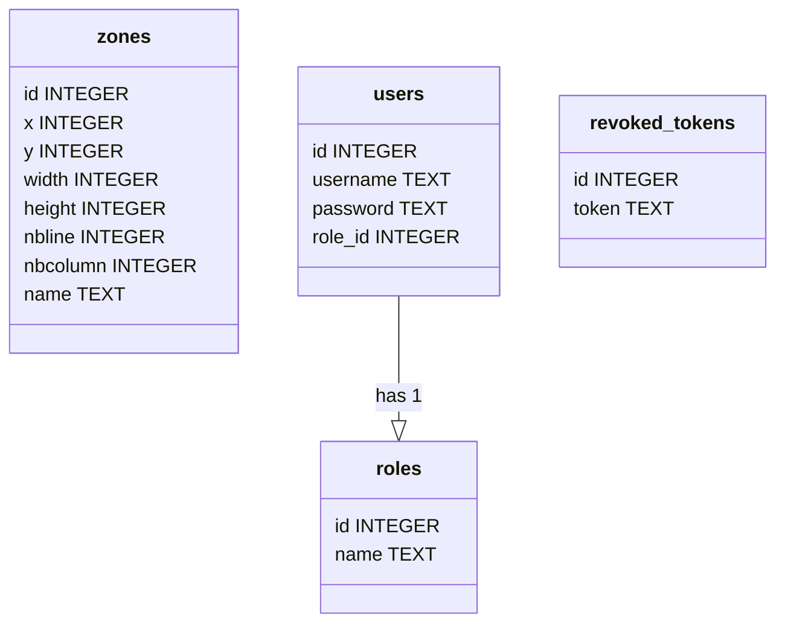
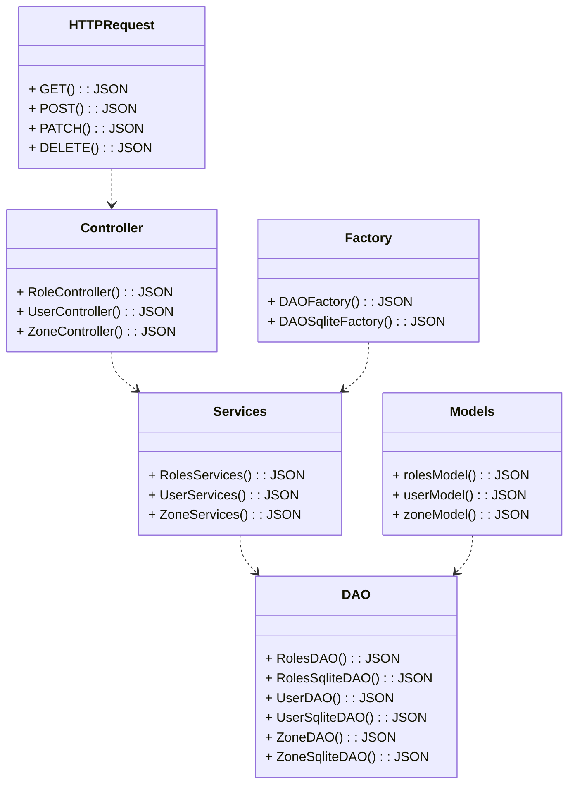
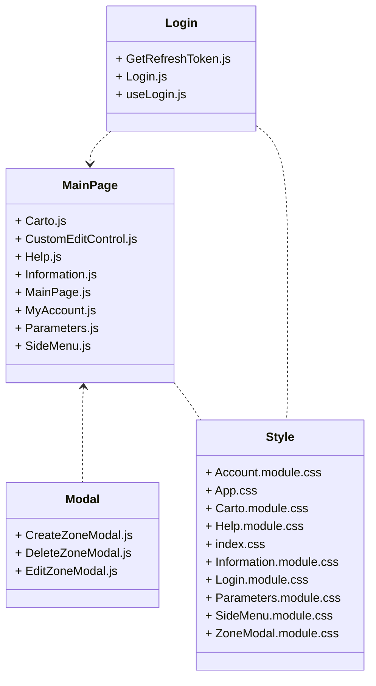

# S5.A.01 - Développement avancé

Loïc SERRE - Étudiants BUT Informatique site d'Arles en Alternance chez MGPS, Manutention Gérée Par Satellite à Port-Saint-Louis-du-Rhône

## Description du projet

Ce projet est un proof of concept (POC) pour la mise en place d'une application multi-plateforme (web et desktop dans mon cas, mais peut être mobile, embarqué, etc...).
Le but de mon application est de permettre à un utilisateur de gérer une cartographie de port commercial.
L'utilisateur pourra alors modifier les emplacements des conteneurs, les déplacer, les supprimer, les ajouter, etc...

# Tâches à réaliser

###### Développement de l'API

- [X] Création des tests unitaires

###### Développement de l'application web

- [X] Création de l'application web

  - [X] Création des test d'intégration
  - [ ] Réalisation des pages de gestion de l'application

    - [X] Réalisation de la page des paramètres du compte
    - [ ] Réalisation de la page des paramètres de l'application

###### CI/CD

- [X] Mise en place du CI/CD

  - [X] Mise en place du CI/CD pour l'API

    - [X] Installation des dépendances dans le CI/CD
    - [X] Génération de la construction de l'API dans le CI/CD
    - [X] Mise en place des tests dans le CI/CD
  - [X] Mise en place du CI/CD pour l'application web

    - [X] Installation des dépendances dans le CI/CD*
    - [X] Génération de la construction de l'application web dans le CI/CD
    - [X] Mise en place des tests dans le CI/CD
  - [X] Réalisation d'un docker compose
  - [X] Hébergement de l'API
  - [X] Hébergement de l'application web
  - [X] Hébergement de la documentation de l'API
  - [X] Hébergement de la documentation de l'application web

###### Revue de projet

- [X] Réalisation des documents de suivis de projet
- [X] Réalisation du compte rendu sur les modifications réalisées
- [X] Réalisation du support de présentation

# Guide d'utilisation

#### Conteneurisation des services

Étant donné que tout est conteneurisé grâce à un docker-compose, il vous suffira de taper la commande `docker-compose up` dans le répertoire où se trouve le fichier *docker-compose.yml* pour lancer chaque service de l'application.

## Configuration

* Main : `index.js`
* Scripts :

  * Test : `mocha`
  * Start : `nodemon index.js`
* Dépendances :

  * bcrypt : `^5.1.1`
  * chai : `^4.3.10`
  * dotenv : `^16.3.1`
  * express : `^4.18.2`
  * jest : `^29.7.0`
  * JSdoc : `npm:jsdoc@^4.0.2`
  * jsonwebtoken : `^9.0.2`
  * mocha : `^10.2.0`
  * nodemon : `^3.0.1`
  * sqlite : `^5.0.1`
  * sqlite3 : `^5.1.6`
  * swagger-ui : `^5.9.0`
* Dépendances de développement :

  * @babel/core : `^7.23.6`
  * @babel/preset-env : `^7.23.6`
  * babel-jest : `^29.7.0`
  * jsdoc : `^4.0.2`

## Guide d'utilisation de l'API

#### Conteneurisation de l'API

- Un dockerfile est présent dans le répertoire, il permet de générer une image docker, il est très pratique et vous évitera d'avoir à installer un environnement. Pour lancer la création de l'image docker il vous suffit de vous placer dans le dossier API, là où il y a le fichier *sae-api.Dockerfile* puis exécuter la commande :
  - ```
    docker build -t sae-api -f ./sae-api.Dockerfile .
    ```

#### Lancement de l'API

- Si jamais vous n'avez pas Docker, ou que vous voulez vraiment lancer l'API sur votre machine voici la marche à suivre :
  - cloner le dépôt sur votre machine avec :

    - ```
      git clone https://etulab.univ-amu.fr/s21213416/s5.a.01-developpement-avance.git
      ```
    - Placer vous dans le dossier API
  - Mettez vous dans le dossier API et faite :

    - ```
      npm install
      ```
    - ```
      npm start
      ```

Suite à cela l'API devrait être fonctionnelle dans votre terminal.

###### Documentation de l'API

- Si vous voulez voir la documentation de l'api, rien de plus simple, il suffit d'aller dans le dossier API puis doc, vous y trouverez un dossier docfile dans laquelle se trouve toutes les pages HTML de la documentation. Choisissez en un et ouvrez-le et vous pourrez naviguer dans la documentation comme bon vous semble.
- Si toutefois vous voulez régénérer la documentation il vous suffira de vous placer dans le dossier *doc* et de faire *:*
  - ```
    npx jsdoc -c parameter.json
    ```

###### Jeux de test

- Des jeux de test sont présent dans l'API, pour les executer il suffit de faire :

  - `npm test`

###### Enpoints

**Roles**

- **Get Roles:**`GET http://localhost:3000/roles`
- **Update Role:**`PATCH http://localhost:3000/roles/1`
- **Add Role:**`POST http://localhost:3000/roles`
- **Delete Role:**`DELETE http://localhost:3000/roles/2`

**Zones**

- **Get Zones:**`GET http://localhost:3000/zones`
- **Update Zone:**`PATCH http://localhost:3000/zones/1`
- **Add Zone:**`POST http://localhost:3000/zones`
- **Delete Zone:**`DELETE http://localhost:3000/zones/1`

**Users**

- **Get Users:**`GET http://localhost:3000/users`
- **Update User:**`PATCH http://localhost:3000/users/2`
- **Add User:**`POST http://localhost:3000/users`
- **Delete User:**`DELETE http://localhost:3000/users/4`

**Login / Disconnect**

- **Send Login:**`POST http://localhost:3000/login`
- **Disconnect:**`POST http://localhost:3000/logout`
- **Refresh Token:**`POST http://localhost:3000/refreshToken`

## Guide d'utilisation de l'application web

#### Conteneurisation de l'application web

- Un dockerfile est présent dans le répertoire, il permet de générer une image docker, il est très pratique et vous évitera d'avoir à installer un environnement. Pour lancer la création de l'image docker il vous suffit de vous placer dans le dossier webapp, là où il y a le fichier *sae-webapp.Dockerfile* puis exécuter la commande :
  - ```
    docker build -t sae-webapp -f ./sae-webapp.Dockerfile .
    ```

#### Lancement de l'application web

- Si jamais vous n'avez pas Docker, ou que vous voulez vraiment lancer l'application web sur votre machine voici la marche à suivre :

  - cloner le dépôt sur votre machine avec :

    - ```
      git clone https://etulab.univ-amu.fr/s21213416/s5.a.01-developpement-avance.git
      ```
  - Placez-vous dans le dossier webapp pour faire :

    - ```
      npm install
      ```
    - ```
      npm start
      ```
  - Mettez-vous dans le dossier API et faite :

    - ```
      npm install
      ```
    - ```
      npm start
      ```

  Suite à cela l'application web devrait être fonctionnelle dans votre navigateur. Il vous suffira de vous connecter avec un utilisateur présent dans la base de données. Comme par exemple :- username : `admin` / password : `admin`

  - username : `user` / password : `user`
  - guest : `guest` / password : `guest`

###### Tutoriel d'utilisation de l'application web

Dans cette application vous aurez tout d'abord la page de connexion, il vous suffira de vous connecter avec un utilisateur présent dans la base de données. Comme par exemple :

- username : `admin` / password : `admin`
- username : `user` / password : `user`
- guest : `guest` / password : `guest`

Ensuite, vous arriverez sur la page d'accueil, vous pourrez naviguer entre les différentes pages de l'application grâce au menu latéral. Vous pourrez également vous déconnecter grâce au bouton déconnexion présent dans le menu latéral.

Je vais vous faire une brève description des différentes pages de l'application.

- **Cartographie :** Cette page vous permettra de voir la cartographie de votre port, vous pourrez également ajouté, supprimer, modifier des zones de votre port.
  - Pour cela, il y aura un bouton avec un + en haut à droite. Une fois le bouton appuyé, une boite modale s'ouvrira et vous pourrez rentrer les informations de votre zone. Une fois les informations rentrées vous pourrez appuyer sur le bouton ajouter et votre zone sera ajoutée à la cartographie.
  - Si vous voulez supprimer une zone il vous suffira de cliquer sur le bouton supprimer et une boite modale s'ouvrira, il vous suffira de choisir l'ID de la zone que vous voulez supprimer et appuyer sur supprimer.
  - Si vous voulez modifier une zone il vous suffira de cliquer sur le bouton "éditer" en haut à droite de la page. Une fois le bouton appuyé, une boite modale s'ouvrira et vous pourrez sélectioner l'ID de la zone que vous voulez modifier. Une fois l'ID sélectionné, vous aurez une seconde boite modale qui s'ouvrira avec toute les informations de la zone selectionnée. Vous pourrez alors modifier les informations que vous voulez et appuyer sur le bouton "modifier" pour modifier la zone.
  - **Mon compte :**
  - **Paramètres :**
  - **Aide :**
    - Cette page vous permettra d'avoir de l'aide sur l'application, vous aurez une description de l'application ainsi que des informations sur les différentes fonctionnalités de l'application, vous pourrez également avoir accès à un tutoriel comme celui-ci.
  - **À propos :**
    - Cette page vous permettra d'avoir des informations sur l'application, comme par exemple le nom de l'application, le nom de l'entreprise, le nom de l'auteur, etc...

###### Documentation de l'application web

- Si vous voulez voir la documentation de l'application web, rien de plus simple, il suffit d'aller dans le dossier webapp puis doc, vous y trouverez un dossier docfile dans laquelle se trouve toutes les pages HTML de la documentation. Choisissez en un et ouvrez-le et vous pourrez naviguer dans la documentation comme bon vous semble.
- Si toutefois vous voulez régénérer la documentation il vous suffira de vous placer dans le dossier *doc* et de faire *:*
  - ```
    npx jsdoc -c parameter.json
    ```

###### Jeux de test

Des jeux de test sont présents dans l'application web, pour les exécuter, il suffit de faire :

- `npm test`

# Analyse et conception

Diagramme UML de la base de données



Dictionnaire de données :

* **Table `zones`**
  * `id` : Clé primaire, entier, auto-incrémenté
  * `x` : Entier, non nul
  * `y` : Entier, non nul
  * `width` : Entier, non nul
  * `height` : Entier, non nul
  * `nbline` : Entier, non nul
  * `nbcolumn` : Entier, non nul
  * `name` : Texte, non nul
* **Table `roles`**
  * `id` : Clé primaire, entier, auto-incrémenté
  * `name` : Texte, non nul
* **Table `users`**
  * `id` : Clé primaire, entier, auto-incrémenté
  * `username` : Texte, non nul
  * `password` : Texte, non nul
  * `role_id` : Entier, clé étrangère référençant `id` dans la table `roles`
* **Table `revoked_tokens`**
  * `id` : Clé primaire, entier, auto-incrémenté
  * `token` : Texte, non nul

Architecture de l'API :



Architecture de l'application web :



# Suivis de projet

| Tâche                                          | Description                                                                                                              | Date de début | Date de fin | Nombre d'heures |
| ----------------------------------------------- | ------------------------------------------------------------------------------------------------------------------------ | -------------- | ----------- | --------------- |
| Test unitaires                                  | Création des test unitaires pour tester l'API                                                                           | 04/03/2024     | 05/03/2024  | 4               |
| Test d'intégration                             | Création des test d'intégration pour tester l'affichage de l'application web                                           | 05/03/2024     | 06/03/2024  | 4               |
| DockerFile                                      | Création des différents dockerfile pour chaque partie (API, webapp, documentations)                                    | 07/03/2024     | 07/03/2024  | 1               |
| Mise en place du CI/CD                          | Mise en place d'un fichier .gitlab-ci.yml pou faire le CI/CD sur etulab                                                  | 08/03/2024     | 09/03/2024  | 5               |
| Mise en place des tests dans le CI/CD           | Mise en place des test pour tester l'API et l'application REACT dans le CI/CD                                            | 10/03/2024     | 11/03/2024  | 1               |
| Dockerisation de l'API et de la webapp          | Dockerfile pour pouvoir dockeriser l'API et l'application web                                                            | 12/03/2024     | 13/03/2024  | 3               |
| Préparation pour le déploiement dans le CI/CD | Recherche et configuration pour permettre l'hébergement de tout les services, ainsi que les documentations              | 14/03/2024     | 15/03/2024  | 2               |
| CI/CD                                           | Mise en place de la copie des fichiers vers le serveur pour pouvoir lancer le docker compose et déployée l'application | 16/03/2024     | 16/03/2024  | 3               |
| Configuration du serveur pour le CI/CD          | Mise en place des dossiers/fichier/configuration pour la mise en place du CI/CD                                          | 02/04/2024     | 02/04/2024  | 3               |
| Page paramètre de compte                       | Page permettant de mettre à jour son nom d'utilisateur, son mot de passe                                                | 03/04/2024     | 03/04/2024  | 7               |
| Document de suivis de projet                    | Mise à jour des documents de suivis de projet avec tout les informations pour le semestre 6                             | 04/04/2024     | 04/04/2024  | 1.5             |
| Compte rendu                                    | Rédaction du compte rendu des modifications effectuer lors du semestre 6                                                | 06/04/2024     | 06/04/2024  | 4.25            |
| Support de présentation                        | Réalisation du support de présentation pour le second oral de SAE                                                      | 07/04/2024     | 07/04/2024  | 4.5             |

## Total des heures

| Total des heures          | 45.25 |
| ------------------------- | ----- |
| Test unitaires            | 4     |
| Test d'intégration       | 4     |
| CI/CD                     | 18    |
| Page paramètre de compte | 7     |
| Suivis de projet          | 1.5   |
| Document de rendu         | 4.25  |
| Veille numérique         | 2     |
