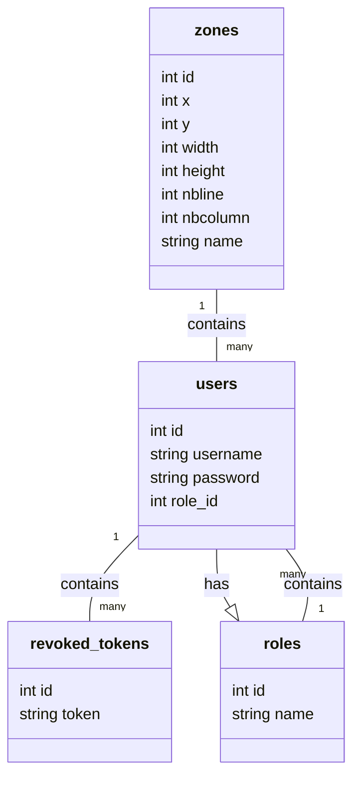

# S5.A.01 - Développement avancé

Loïc SERRE - Étudiants BUT Informatique site d'Arles en Alternance chez MGPS, Manutention Gérée Par Satellite à Port-Saint-Louis-du-Rhône

## Description du projet

Ce projet est un proof of concept (POC) pour la mise en place d'une application multi-plateforme (web et desktop dans mon cas, mais peut être mobile, embarqué, etc...).
Le but de mon application est de permettre à un utilisateur de gérer une cartographie de port commercial.
L'utilisateur pourra alors modifier les emplacements des conteneurs, les déplacer, les supprimer, les ajouter, etc...

# Tâche à réaliser

###### Début du projet

- [X] Initialisation du projet
  - [X] Initialisation du projet avec npm
  - [X] Création des documents de gestion de projet
  - [X] Préparation pour la génération de la documentation
  - [X] Préparation pour les jeux de test
  - [X] Préparation des tests d'intégrations dans PostMan
  - [X] Création du fichier Dockerfile

###### Base de données

- [X] Création de la base de données
  - [X] Création d'une fonction JavaScript permettant de créer la base de données
  - [X] Insertion de données de test dans la base de données

###### Développement de l'API

- [X] Création de l'API
  - [X] Création des entitées
  - [X] Création des DAO
  - [X] Création des Factory
  - [X] Création des routes
    - [X] Mise en place de PostMan pour tester les routes
  - [X] Création des contrôleurs
  - [X] Créations des services
  - [X] Création des tests unitaires
- [X] Génération de la documentation de l'API avec mocha
- [X] Gestion de la connexion
  - [X] Chiffrement des mots de passe
  - [X] Token de connexion
  - [X] Refresh Token
  - [X] Gestion des autorisations

###### Développement de l'application web

- [ ] Création de l'application web

  - [X] Choix du framework
  - [X] Initialisation du projet
  - [X] Création de la page de connexion
  - [X] Création de l'interface globale

    - [X] Création du menu latéral
    - [X] Création des différentes page de l'application
  - [X] Génération de la cartographie par rapport à la base de données
  - [X] Développement des fonctionnalités de la cartographie

    - [X] Suppression des conteneurs
    - [X] Ajout de conteneurs
    - [X] Modification des conteneurs
  - [ ] Réalisation des pages de gestion de l'application

    - [ ] Réalisation de la page des paramètres du compte
    - [ ] Réalisation de la page des paramètres de l'application
    - [X] Réalisation de la page d'aide
    - [X] Réalisation de la page à propos
  - [ ] Génération de la documentation de l'application web

###### Développement de l'application desktop

- [ ] Création de l'application desktop
  - [ ] Choix du framework
  - [ ] Initialisation du projet
  - [ ] Création de la page de connexion
  - [ ] Génération de la cartographie par rapport à la base de données
  - [ ] Développement des fonctionnalités de la cartographie
    - [ ] Déplacement des conteneurs
    - [ ] Suppression des conteneurs
    - [ ] Ajout de conteneurs
    - [ ] Modification des conteneurs
  - [ ] Génération de la documentation de l'application desktop

###### CI/CD

- [ ] Mise en place du CI/CD
  - [ ] Mise en place du CI/CD pour l'API
    - [X] Installation des dépendances dans le CI/CD
    - [X] Génération de la construction de l'API dans le CI/CD
    - [ ] Mise en place des tests dans le CI/CD
  - [ ] Mise en place du CI/CD pour l'application web
    - [X] Installation des dépendances dans le CI/CD*
    - [X] Génération de la construction de l'application web dans le CI/CD
    - [ ] Mise en place des tests dans le CI/CD
  - [ ] Mise en place du CI/CD pour l'application desktop
    - [ ] Installation des dépendances dans le CI/CD
    - [ ] Génération de la construction de l'application desktop dans le CI/CD
    - [ ] Mise en place des tests dans le CI/CD
  - [X] Réalisation d'un docker compose
  - [ ] Hébergement de l'API
  - [ ] Hébergement de l'application web
  - [ ] Hébergement de l'application desktop
  - [ ] Hébergement de la documentation de l'API
  - [ ] Hébergement de la documentation de l'application web
  - [ ] Hébergement de la documentation de l'application desktop

###### Revue de projet

- [ ] Réalisation du diaporama de présentation

# Guide d'utilisation

## Configuration

* Main : `index.js`
* Scripts :

  * Test : `mocha`
  * Start : `nodemon index.js`
* Dépendances :

  * bcrypt : `^5.1.1`
  * chai : `^4.3.10`
  * dotenv : `^16.3.1`
  * express : `^4.18.2`
  * jest : `^29.7.0`
  * JSdoc : `npm:jsdoc@^4.0.2`
  * jsonwebtoken : `^9.0.2`
  * mocha : `^10.2.0`
  * nodemon : `^3.0.1`
  * sqlite : `^5.0.1`
  * sqlite3 : `^5.1.6`
  * swagger-ui : `^5.9.0`
* Dépendances de développement :

  * @babel/core : `^7.23.6`
  * @babel/preset-env : `^7.23.6`
  * babel-jest : `^29.7.0`
  * jsdoc : `^4.0.2`

## Guide d'utilisation de l'API

#### Conteneurisation de l'API

- Un dockerfile est présent dans le repertoire, il permet de générer un image docker, il est très pratique et vous évitera d'avoir à installer un environnement. Pour lancer la création de l'image docker il vous suffit de vous placer dans le dossier API, la ou il y a le fichier *sae-api.Dockerfile* puis executer la commande :
  - ```
    docker build -t sae-api -f ./sae-api.Dockerfile .
    ```

#### Lancement de l'API

- Si jamais vous n'avez pas Docker, ou que vous voulez vraiment lancer l'API sur votre machine voici la mache à suivre :
  - cloner le dépot sur votre machine avec :

    - ```
      git clone https://etulab.univ-amu.fr/s21213416/s5.a.01-developpement-avance.git
      ```
    - Placer vous dans le dossier API
  - Mettez vous dans le dossier API et faite :

    - ```
      npm install
      ```
    - ```
      npm start
      ```

Suite à cela l'API devrait être fonctionnelle dans votre terminal.

###### Documentation de l'API

- Si vous voulez voir la documentation de l'api, rien de plus simple, il suffit d'aller dans le dossier API puis doc, vous y trouverez un dossier docfile dans laquelle se trouve toute les pages HTML de la documentation. Choisissez en un et ouvrez le et vous pourrez naviguer dans la documentation comme bon vous semble.
- Si toutefois vous voulez regenerer la documentation il vous suffira de vous placer dans le dossier *doc* et de faire *:*
  - ```
    jsdoc -c parameter.json
    ```

###### Jeux de test

- Des jeux de test sont présent dans l'API, pour les executer il suffit de faire :

  - `npm test`

###### Enpoints

**Roles**

- **Get Roles:**`GET http://localhost:3000/roles`
- **Update Role:**`PATCH http://localhost:3000/roles/1`
- **Add Role:**`POST http://localhost:3000/roles`
- **Delete Role:**`DELETE http://localhost:3000/roles/2`

**Zones**

- **Get Zones:**`GET http://localhost:3000/zones`
- **Update Zone:**`PATCH http://localhost:3000/zones/1`
- **Add Zone:**`POST http://localhost:3000/zones`
- **Delete Zone:**`DELETE http://localhost:3000/zones/1`

**Users**

- **Get Users:**`GET http://localhost:3000/users`
- **Update User:**`PATCH http://localhost:3000/users/2`
- **Add User:**`POST http://localhost:3000/users`
- **Delete User:**`DELETE http://localhost:3000/users/4`

**Login / Disconnect**

- **Send Login:**`POST http://localhost:3000/login`
- **Disconnect:**`POST http://localhost:3000/logout`
- **Refresh Token:**`POST http://localhost:3000/refreshToken`

## Guide d'utilisation de l'application web

#### Conteneurisation de l'application web

#### Lancement de l'application web

- Si jamais vous n'avez pas Docker, ou que vous voulez vraiment lancer l'application web sur votre machine voici la marche à suivre :

  - cloner le dépot sur votre machine avec :

    - ```
      git clone https://etulab.univ-amu.fr/s21213416/s5.a.01-developpement-avance.git
      ```
  - Placer vous dans le dossier webapp pour faire :

    - ```
      npm install
      ```
    - ```
      npm start
      ```
  - Mettez vous dans le dossier API et faite :

    - ```
      npm install
      ```
    - ```
      npm start
      ```

  Suite à cela l'application web devrait être fonctionnelle dans votre navigateur. Il vous suffira de vous connecter avec un utilisateur présent dans la base de données. Comme par exemple :- username : `admin` / password : `admin`

  - username : `user` / password : `user`
  - guest : `guest` / password : `guest`

###### Tutoriel d'utilisation de l'application web

Dans cette application vous aurez tout d'abord la page de connexion, il vous suffira de vous connecter avec un utilisateur présent dans la base de données. Comme par exemple :

- username : `admin` / password : `admin`
- username : `user` / password : `user`
- guest : `guest` / password : `guest`

Ensuiite vous arriverez sur la page d'accueil, vous pourrez naviguer entre les différentes pages de l'application grâce au menu latéral. Vous pourrez également vous déconnecter grâce au bouton déconnexion présent dans le menu latéral.

Je vais vous faire une brève description des différentes pages de l'application.

- **Cartographie :** Cette page vous permettra de voir la cartographie de votre port, vous pourrez également ajouter, supprimer, modifier des zones de votre port.
  - Pour cela il y aura un bouton avec un + en haut à droite. Une fois le bouton appuyer une boite modale s'ouvrira et vous pourrez rentrer les informations de votre zone. Une fois les informations rentrées vous pourrez appuyer sur le bouton ajouter et votre zone sera ajoutée à la cartographie.
  - Si vous voulez supprimer une zone il vous suffira de cliquer sur la zone que vous voulez supprimer et une boite modale s'ouvrira, il vous suffira de choisir l'ID de la zones que vous voulez supprimer et appuyer sur supprimer.
  - Si vous voulez modifier une zone il vous suffira de cliquer sur le bouton éditer en haut à droite de la page. Une fois le bouton appuyer une boite modale s'ouvrira et vous pourrez selectioner l'ID de la zone que vous voulez modifier. Une fois l'ID selectionné, vous aurez une seconde boite modale qui s'ouvrira avec toute les informations de la zone selectionnée. Vous pourrez alors modifier les informations que vous voulez et appuyer sur le bouton modifier pour modifier la zone.
  - **Mon compte :**
  - **Paramètres :**
  - **Aide :**
    - Cette page vous permettra d'avoir de l'aide sur l'application, vous aurez une description de l'application ainsi que des informations sur les différentes fonctionnalités de l'application, vous pourrez également avoir accès à un tutoriel comme celui-ci.
  - **À propos :**
    - Cette page vous permettra d'avoir des informations sur l'application, comme par exemple le nom de l'application, le nom de l'entreprise, le nom de l'auteur, etc...

###### Documentation de l'application web

###### Jeux de test

## Guide d'utilisation de l'application desktop

# Analyse et conception

Diagramme UML de la base de donnée



Dictionnaire de données :

* **Table `zones`**
  * `id` : Clé primaire, entier, auto-incrémenté
  * `x` : Entier, non nul
  * `y` : Entier, non nul
  * `width` : Entier, non nul
  * `height` : Entier, non nul
  * `nbline` : Entier, non nul
  * `nbcolumn` : Entier, non nul
  * `name` : Texte, non nul
* **Table `roles`**
  * `id` : Clé primaire, entier, auto-incrémenté
  * `name` : Texte, non nul
* **Table `users`**
  * `id` : Clé primaire, entier, auto-incrémenté
  * `username` : Texte, non nul
  * `password` : Texte, non nul
  * `role_id` : Entier, clé étrangère référençant `id` dans la table `roles`
* **Table `revoked_tokens`**
  * `id` : Clé primaire, entier, auto-incrémenté
  * `token` : Texte, non nul

# Suivis de projet

| Tâche                                                       | Description                                                                                                                                                                                 | Date de début | Date de fin | Nombre d'heures |
| ------------------------------------------------------------ | ------------------------------------------------------------------------------------------------------------------------------------------------------------------------------------------- | -------------- | ----------- | --------------- |
| Initialisation du projet                                     | Configuration du projet (npm init,<br />ajout des différents fichiers qui seront utiles, document de gestion de projet...)                                                                 | 14/12/2023     | 14/12/2023  | 2               |
| Création de la base de données                             | Création d'une fonction JavaScript permettant<br />de gérer les différentes tables de la base de données et également d'y mettre des données de test pour le développement de l'API. | 14/12/2023     | 15/12/2023  | 1.5             |
| Création du dockerfile                                      | Fichier Dockerfile pour pouvoir virtualiser l'api et l'utiliser plus facilement quand elle sera finis                                                                                       | 15/12/2023     | 15/12/2023  | 0.5             |
| Mise à jour du documents de suivis de projet                | Cette case dénombre le temps que je passe à éditer les documents de suivis de projet                                                                                                     | 14/12/2023     | 15/12/2023  | 0.5             |
| Création des entitiées                                     | Création des différentes entitées représentant un éléments de chaque table de la base de données                                                                                     | 15/12/2023     | 15/12/2023  | 0.75            |
| Création des DAO                                            | Création des DAO et création de la structure des DAOSqlite                                                                                                                                | 15/12/2023     | 16/12/2023  | 1.5             |
| Création des Factory                                        | Création complete des factory                                                                                                                                                              | 16/12/2023     | 16/12/2023  | 0.75            |
| Mise à jour du documents de suivis de projet                | Cette case dénombre le temps que je passe à éditer les documents de suivis de projet                                                                                                     | 16/12/2023     | 16/12/2023  | 0.5             |
| Création des routes                                         | Création des parametres de routes pour chaque services de l'API                                                                                                                            | 16/12//2023    | 16/12/2023  | 0.5             |
| Mise en place de PostMan pour tester les routes              | Configuration de POSTMAN pour                                                                                                                                                               | 17/12/2023     | 17/12/2023  | 0.5             |
| Création des contrôleurs                                   | Finalisation des controleurs pour chaque services de l'api                                                                                                                                  | 16/12/2023     | 16/12/2023  | 3               |
| Finalisation des DAO                                         | Finsaliation des DAO pour Sqlite                                                                                                                                                            | 17/12/2023     | 17/12/2023  | 2               |
| Création des services                                       | Création complete des services                                                                                                                                                             | 16/12/2023     | 16/12/2023  | 0.75            |
| Mise à jour du documents de suivis de projet                | Cette case dénombre le temps que je passe à éditer les documents de suivis de projet                                                                                                     | 17/12/2023     | 17/12/2023  | 0.5             |
| Chiffrement des mots de passe                                | Ajout du chiffrement des mots de passe dans la base de données et à l'ajout d'un utilisateurs                                                                                             | 17/12/2023     | 17/12/2023  | 0.5             |
| Token de connexion                                           | Ajout d'un middle ware pour verifier la connexion                                                                                                                                           | 17/12/2023     | 17/12/2023  | 1.5             |
| Mise à jour du documents de suivis de projet                | Cette case dénombre le temps que je passe à éditer les documents de suivis de projet                                                                                                     | 17/12/2023     | 17/12/2023  | 0.25            |
| Ajout de la déconnexion                                     | Création d'une table de token revoquer pour stocker les tokens qui ont été retirer                                                                                                       | 21/12/2023     | 27/12/2023  | 1               |
| Ajout d'un refresh token                                     | Création d'un refresh token, pour améliorer la sécurité de l'API ainsi que sa praticité                                                                                                | 22/12/2023     | 27/12/2023  | 4               |
| Mise à jour des test d'intégration de postman              | Mise à jour de toutes les routes présente sur postman pour rajouter le refresh token                                                                                                      | 26/12/2023     | 26/12/2023  | 0.25            |
| Mise à jour du documents de suivis de projet                | Cette case dénombre le temps que je passe à éditer les documents de suivis de projet                                                                                                     | 27/12/2023     | 27/12/2023  | 0.25            |
| Mise en place des autorisations                              | Un utilisateur en fonction de son role pourra ou non accéder à chaque partie de l'application                                                                                             | 26/12/2023     | 27/12/2023  | 4               |
| Création des tests unitaires                                | Réalisation des jeux de test pour les DAO                                                                                                                                                  | 27/12/2023     | 28/12/2023  | 4               |
| Mise à jour du documents de suivis de projet                | Cette case dénombre le temps que je passe à éditer les documents de suivis de projet                                                                                                     | 28/12/2023     | 28/12/2023  | 1               |
|                                                              |                                                                                                                                                                                             |                |             |                 |
| **API Finalisée**                                     |                                                                                                                                                                                             |                |             |                 |
|                                                              |                                                                                                                                                                                             |                |             |                 |
| Début de l'application web en REACT                         | Remise en mémoire du framework react ainsi que configuration du projet                                                                                                                     | 28/12/2023     | 28/12/2023  | 1               |
| Mise en place de la page de connexion                        | Création de la page, de son style, ainsi que son fonctionnement                                                                                                                            | 28/12/2023     | 29/12/2023  | 5               |
| Mise à jour du documents de suivis de projet                | Cette case dénombre le temps que je passe à éditer les documents de suivis de projet                                                                                                     | 29/12/2023     | 29/12/2023  | 0.25            |
| Mise en place d'un menu latéral                             | C'est le menu burger, sur le coté, il permet de naviguer entre les différentes page de l'application                                                                                      | 29/12/2023     | 29/12/2023  | 2               |
| Création des différentes routes pour les différentes page | J'ai rajouter un lien entre le menu latéral et différentes page, pour l'instant vide mais c'est pour avoir une architecture,<br />maintenant il faut remplir ces différentes pages       | 29/12/2023     | 29/12/2023  | 3               |
| Mise à jour du documents de suivis de projet                | Cette case dénombre le temps que je passe à éditer les documents de suivis de projet                                                                                                     | 29/12/2023     | 29/12/2023  | 0.25            |
| Page cartographie                                            | Interface de la page cartographie ainsi que génération de cette derniere avec les données de test présents dans la base de données                                                     | 29/12/2023     | 29/12/2023  | 4               |
| Page Aide                                                    | Réalisation de la page aide, pour obtenir quelque aide sur l'application                                                                                                                  | 29/12/2023     | 30/12/2023  | 3.5             |
| Page à propos                                               | Réalisation de la page à propos pour donner quelque informations sur l'application                                                                                                        | 30/12/2023     | 30/12/2023  | 3.5             |
| Fonctionalités de modification de zones                     | Pouvoir modifier facilement une zone (ses coordonées, ses dimensions, son nom...)                                                                                                          | 12/01/2024     | 14/01/2024  | 11              |
| Fonctionalités de suppression de zones                      | Pouvoir supprimer facilement une zones sur la cartographie                                                                                                                                  | 15/01/2024     | 15/01/2024  | 5               |
| Fonctionalités d'ajout d'une zone                           | Ajout d'une zone sur la cartographie, par le biais d'une boite modale                                                                                                                       | 04/01/2024     | 16/01/2024  | 6.5             |
| Mise à jour du documents de suivis de projet                | Cette case dénombre le temps que je passe à éditer les documents de suivis de projet                                                                                                     | 16/01/2024     | 16/01/2024  | 1               |
| Mise en place du CI/CD                                       | Mise en place d'un fichier .gitlab-ci.yml pour faire le CI/CD sur etulab                                                                                                                    | 16/01/2024     | 16/01/2024  | 5               |
| Mise à jour du documents de suivis de projet                | Cette case dénombre le temps que je passe à éditer les documents de suivis de projet                                                                                                     | 17/01/2024     | 17/01/2024  | 0.5             |
| Mise en place des tests dans le CI/CD                        | Mise en place des test pour tester l'API et l'application REACT dans le CI/CD                                                                                                               | 16/01/2024     |             |                 |
| Rafraichissement de la cartographie après une modification  | Des lors que on effectue une action sur la cartographie, elle est rafraichie avec les nouvelles données                                                                                    | 19/01/2024     | 19/01/2024  | 3               |
| Dockerisation de l'API et de la webapp                       | Dockerfile pour pouvoir dockeriser l'API et l'application web                                                                                                                               | 20/01/2024     | 20/01/2024  | 3               |
| Docker Compose pour les services                             | Permet de créer les images et les containers                                                                                                                                               | 20/01/2024     | 20/01/2024  | 1.5             |
| Mise en place Websocket                                      | Mise en place de websocket entre l'api et l'application web pour que la cartographie se mette à jour en temps réel                                                                        |                |             |                 |

## Total des heures

| Total des heures                        | 95.25 |
| --------------------------------------- | ----- |
| Initialisation du projet                | 2.5   |
| Documents de suivis de projet           | 5     |
| Base de données                        | 1.5   |
| Développement de l'API                 | 25.25 |
| Développement de l'application web     | 54.5  |
| CI/CD                                   | 6.5   |
| Développement de l'application desktop | 0     |
| Revue de projet                         | 0     |
